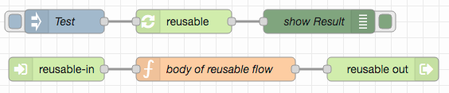
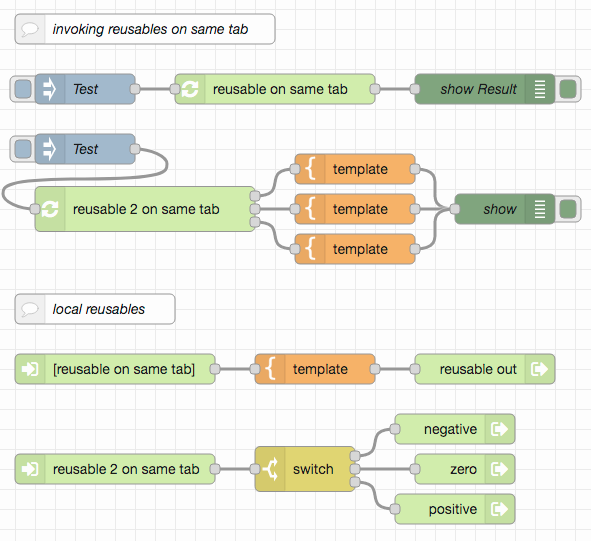
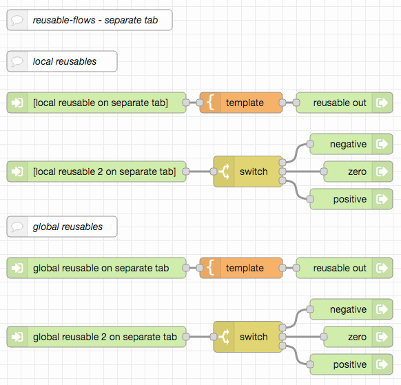
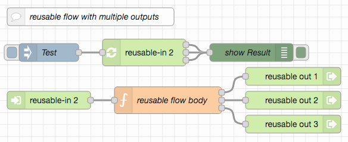
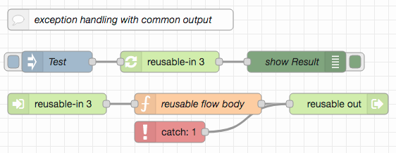
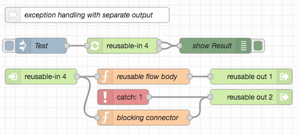
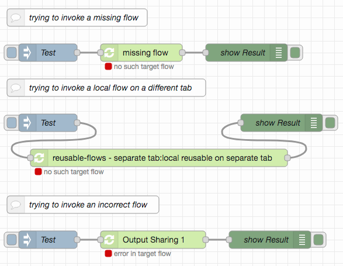
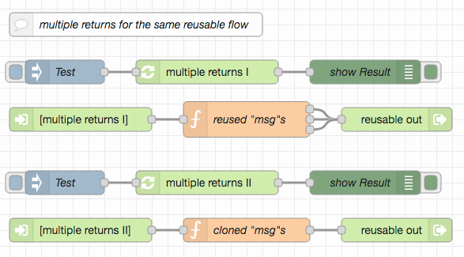

# node-red-contrib-reusable-flows #

`node-red-contrib-reusable-flows` provides nodes that represent complete flows and make them "callable" from other flows (returning to the calling node when the end of a "reusable flow" has been reached).

The desire for such a package arose from the need to be able to reuse existing flows without having to copy them and without having to spend a separate editor tab for each such flow.

The underlying objective is to have an alternative to `function` nodes which is backed by flows rather than JavaScript code - although the "wiring compatibility" would allow to replace "reusable flow" nodes by (probably more efficient) `function` nodes at a later time, should performance become relevant.

Three types of nodes are involved:



* **`reusable-in`** - starts a new "reusable flow"
* **`reusable-out`** - ends a "reusable flow"<br>(multiple `reusable-out` nodes are allowed for the same `reusable-in`)
* **`reusable`** - effectively "invokes" a "reusable flow"<br>(i.e., the incoming `msg` is passed to the associated `reusable-in` and the `msg` read by the first triggered `reusable-out` passed back to the appropriate output of this `reusable` node)

**NPM users**: please consider the [Github README](https://github.com/rozek/node-red-contrib-reusable-flows/blob/main/README.md) for the latest description of this package (as updating the docs would otherwise always require a new NPM package version)

> Just a small note: if you like this work and plan to use it, consider "starring" this repository (you will find the "Star" button on the top right of [this page at GitHub](https://github.com/rozek/node-red-contrib-reusable-flows/blob/main/README.md)), so that I know which of my repositories to take most care of.

### Alternatives ###

Node-RED (and its ecosystem) already offer some mechanisms to structure non-trivial flows:

* **Subflows** are very similar to "reusable flows" - but each subflow consumes its own tab in the editor which makes work with many subflows unmanageable
* **Link In** and **Link Out** nodes have their own raison d'être but are more like "goto"s rather than invocations
* **Link Call** nodes (available since version 2.1.0 for flows starting with a **Link In** and ending with a **Link Out** node put into "return" mode) do not support flows with multiple outputs
* **Action Flows** (from [node-red-contrib-actionflows](https://flows.nodered.org/node/node-red-contrib-actionflows)) are really powerful, but their name prefix matching scheme can lead to difficult to find problems - and they do not support multiple outputs
* **Components** (from [node-red-contrib-components](https://flows.nodered.org/node/node-red-contrib-components)) come quite close to what "reusable flows" aim to provide - but the association between "callers" and "callees" is based on the unique ids of the associated nodes which caused several problems in the past (but may have been fixed in the mean time)

## Installation ##

To install these nodes, use `Menu` ➜ `Manage palette` ➜ `Install`, search for module `node-red-contrib-reusable-flows` and click on `install`.

Alternatively, run the following command from a command line after navigating to your Node-RED user directory (typically `~/.node-red`):

```
npm install node-red-contrib-reusable-flows
```

restart your Node-RED server and (if already open) reload the Node-RED editor.

The nodes `reusable-in`, `reusable-out` and `reusable` will then appear in the palette within group "advanced".

## Flow Design ##


The typical workflow of designing and using "reusable flows" is as follows (individual features will be explained in the following sections):

1. drag a `reusable-in` node from the palette onto your workspace and open the configuration editor by double-clicking it
2. enter a descriptive name for this node and choose its scope (new `reusable-in` nodes are `local` by default)
3. if desired, add any nodes you need in order to implement the new "reusable flow"
4. then drag a `reusable-out` node from the palette onto your workspace and make sure that this node is directly or indirectly connected to the `reusable-in` node created before
5. add more `reusable-out` nodes for the `reusable-in` as needed (but don't forget to select different output positions and - if need be - different output labels for each of them)
6. you are now ready to drag a `reusable` node from the palette onto your workspace and configure the newly created "reusable flow" as its target. For that purpose double-click on the `reusable` node and choose the intended "reusable flow" from the drop-down menu. Save your configuration by clicking on "Done"

### Reusable Flow Lookup ###

"Reusable flows" are found by the name of their `reusable-in` nodes. Within the Node-RED flow editor, a drop-down menu simplifies name input by offering a choice of all currently found `reusable-in` nodes. However, if the name of a `reusable-in` that has already been chosen as the target of any `reusable` nodes is changed at a later time, all these `reusable` nodes will loose their association and will have to be reassigned again.



`reusable` nodes may invoke "reusable flows" on the same tab or on different tabs. If the targeted `reusable-in` is found on a different tab than the `reusable`, the target flow name has to be prefixed with the name of the tab it is found in, and separated from the `reusable-in` name by a colon (`:`) - for that reason, **neither tab labels nor the names of `reusable-in` nodes should contain any colons!** Again, the editor's drop-down menu simplifies the assignment, but changing the tab label at a later time will require a reassignment of all `reusable` nodes from other tabs that refer to flows on this one.

### Scoping ###

Being able to place several "reusable flows" on a single tab allows for the implementation of flow "libraries". For that purpose, a `scope` property can be used to classify `reusable-in` nodes as either "private" or "public": `reusable-in` nodes with scope `local` may be invoked from the same tab only, those with scope `global` from everywhere.




Within the Node-RED editor, the target flow drop-down menu of `reusable` nodes already takes the visibility of `reusable-in` nodes into account and presents actually visible flows only.

### Single or Multiple Outputs ###

A "reusable flow" may have a single or multiple outputs - depending on the number of `reusable-out` nodes connected to the same `reusable-in`. `reusable` nodes reflect the actual number of outputs of their target flows.




In order to simplify wiring (and keep it consistent across changes) each `reusable-out` node must indicate to which output it belongs. This is done by specifying a "position" (the 1-based number of the output it belongs to) and an optional label (which is shown in any `reusable` node that targets the `reusable-in` connected to this `reusable-out`)

All `reusable-out` nodes connected to the same `reusable-in` must have unique output positions and unique labels (or no label at all). Additionally, no `reusable-out` node may be connected to multiple `reusable-in` nodes.

### Nested and recursive Invocations ###

"Reusable flows" may be "nested", i.e., a "reusable flow" may itself include `reusable` nodes.


A special case of a "nested invocation" is the "recursive invocation" where a "reusable flow" invokes itself. Such invocations are supported as well:


However, recursively invoked "reusable flows" have to support this feature in order to work as intended (see section "Reusable Flows vs. Subroutines") below.

### Exception Handling ###

`catch` nodes may be used to intercept errors that occur within a "reusable flow" and react as needed. In the end, these nodes may be wired either to a separate flow output or to one which is already connected to a `reusable-in` (i.e., which is not part of another `catch` flow)




However, if a `catch` node is supposed to feed a separate `reusable-out` a small problem arises: that output is not connected to any `reusable-in` node. In order to get around this problem, a "dummy connection" has to be established between the `catch` output and the `reusable-in` this `catch` node belongs to. In the simplest case, this may be achieved by inserting a `function` node that does not send any `msg` (i.e., whose body is completely empty) between the `reusable-in` and the `reusable-out` fed by the `catch` node.

Nota bene: a `catch` node must never catch exceptions from nodes which belong to different "reusable flows" or be wired to a `reusable-out` that is connected to a different `reusable-in` than the nodes the `catch` node is observing!

### Link Nodes ###

Link nodes within "reusable flows" are not yet supported:


### Disabled Nodes ###

Disabled `reusable-in` or `reusable-out` nodes or disabled nodes within a "reusable flow" are not recognized as such and will not produce any error messages:


They are just treated as if they were enabled (but cannot be executed, however)

### Resuable Flows and Subflows ###

Due to the special nature of subflows, neither `reusable-in`, `reusable-out` nor `reusable` nodes may be used in subflows. It is, however, perfectly possible to invoke subflows from within a "reusable flow".

## Detection and Display of Design Errors ##

Correct "reusable flows" require a lot of conditions to be met: `reusable` nodes must target an existing (and correct) `reusable-in` node, that node must be directly or indirectly wired to one or multiple `reusable-out` nodes, all `reusable-out` nodes for the same `reusable-in` must be configured for different outputs, etc.

Unfortunately, the Node-RED editor is not yet prepared to handle dependencies between different nodes. As a consequence, the current implementation of "reusable flows" uses a mixture of (error) messages in node configuration dialogs and status messages underneath the nodes themselves in order to indicate design errors. The former appear at design time (i.e., _before_ deployment - but only if the configuration dialog for a faulty node is open), the latter at runtime (i.e., _after_ deployment). As a consequence, status messages may be "out-of-date" if you already fixed the shown errors, but they still give a good overview of what seems to be wrong.

Additionally, **`reusable` nodes may not show the correct number of outputs**, should the number of `reusable-out` nodes for the targeted `reusable-in` have changed. In such a situation, just open the configuration pane for the `reusable` node and close it again by clicking on "Done" - the editor then displays the proper set of outputs.

In order to simplify fixing broken flows, `reusable` nodes also indicate errors in their target flows (i.e., the targeted `reusable-in` and `reusable-out` nodes)

> Nota bene: incorrect `reusable` nodes can not be used. Instead, they write an error message on the debug console whenever they are triggered.

The following screenshots give an overview of how incorrect nodes may look like:




## Inhibiting multiple returns from the same Invocation ##

In order to avoid bugs which may be very difficult to find, "reusable flows" inhibit multiple returns from the same invocation.

If the body of a "reusable flow" splits the flow such that a `msg` (or clones of it) triggers the same `reusable-out` several times or triggers several `reusable-out` nodes one after another, only the first triggered `reusable-out` node will actually return from the invocation - all others will fail.



In other words: a single invocation of a "reusable flow" will only produce a single result.

## Reusable Flows vs. Subroutines (or Procedures, Functions, Methods...) ##

(The following explanation also applies to subflows, "action flows" and "components")

Invoking a separate flow differs considerably from calling a "subroutine" (sometimes called "function", "procedure", "method" or similar): in most programming languages, subroutine invocations create a new "activation context" for arguments, local variables and inner subroutine calls. Any assignments made to the local variables of a subroutine do not interfere with the calling environment (unless the programming language allows you to pass arguments "by reference" or pass objects as arguments and modify the contents of these objects). Similarly, inner subroutine calls do not interfere neither with the calling subroutine nor with that subroutine's calling environment (again, some programming languages allow you to break that rule - but, actually, subroutines were invented for just this isolation)

However, Node-RED works differently.

In Node-RED, complete "_states_" are passed from one node to the next. These states include any invocation arguments (the most important one is `msg.payload`) but also any other data which may be needed to complete an operation (an important example are the `msg` properties set by an `HTTP in` node which are later used by an `HTTP out` node to respond an incoming request). The results of a node operation are often saved into `msg.payload` again, effectively overwriting the initial invocation argument.

Additionally, flows do not provide any "local variables": if you want to store values in one node and use it in another, you will have to store them as part of `msg` and pass them on (nota bene: no, "flow contexts" do not serve that purpose since their contents persist - they should not even be abused for that purpose (_never!_) as nested invocations or multiple flow executions running simultaneously may lead to bugs which are _really difficult_ to find because their occurrence depends on actual execution timing)

Because of this behaviour, it is sometimes necessary to preserve important `msg` properties before other nodes are triggered (this includes nodes representing separate flows) and to restore them afterwards - or, if the same message is to be routed to multiple paths, to "clone" a `msg` (rather than to create new ones) in order to keep any additional state information intact.

_Not keeping this implementation detail in mind may lead to unpredicatable behaviour of "downstream" nodes!_

> Nota bene: the current version of `node-red-contrib-reusable-flows` does not offer explicit support for preserving and restoring important `msg` properties (this is planned for a later release) and leaves it up to the developer to handle them properly.


## Build Instructions ##

You may easily build this package yourself.

Just install [NPM](https://docs.npmjs.com/) according to the instructions for your platform and follow these steps:

1. either clone this repository using [git](https://git-scm.com/) or [download a ZIP archive](https://github.com/rozek/node-red-contrib-reusable-flows/archive/refs/heads/main.zip) with its contents to your disk and unpack it there 
2. open a shell and navigate to the root directory of this repository
3. run `npm install` in order to install the complete build environment
4. execute `npm run build` to create a new build

## License ##

[MIT License](LICENSE.md)
