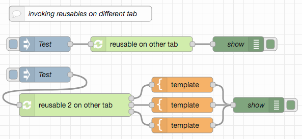
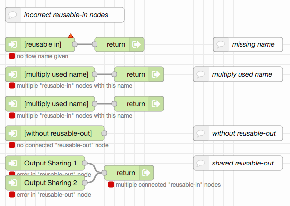
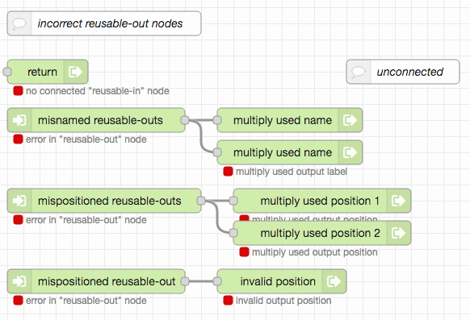
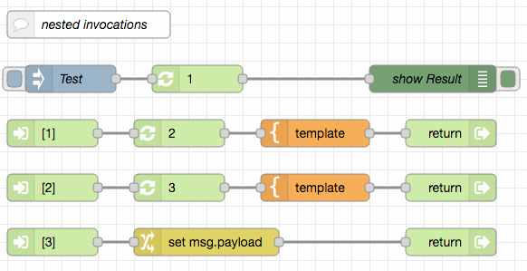

# node-red-contrib-reusable-flows #

`node-red-contrib-reusable-flows` provides nodes that represent complete flows and make them "callable" from other flows (returning to the calling node when the end of a reusable flow has been reached).

The desire for such a package arose from the need to be able to reuse existing flows without having to copy them and without having to spend a separate editor tab for each such flow.

The current goal is to have an alternative to "function" nodes which is backed by flows rather than JavaScript - although the "wiring compatibility" would allow to replace "reusable flow" nodes by (probably more efficient) "function" nodes, should performance become relevant.

Three types of nodes are involved:

* `reusable-in` - starts a new "reusable flow"
* `reusable-out` - ends a "reusable flow" (multiple `reusable-out` nodes are allowed for any `reusable-in`)
* `reusable` - effectively "invokes" a reusable flow (i.e., the incoming `msg` is passed to the associated `reusable-in` and the `msg` read by the first connected `reusable-out` passed to the appropriate output of this `reusable` node)

> Nota bene: this work is currently in progress. Please don't expect it to be finished before end of September 2021!

### Alternatives ###

Node-RED (and its ecosystem) already offer some mechanisms to structure non-trivial flows:

* **Subflows** are very similar to "reusable flows" - but each subflow consumes its own tab in the editor which makes work with many subflows unmanageable
* **Link In** and **Link Out** nodes have their own raison d'être but are more like "goto"s rather than invocations
* **Action Flows** (from [node-red-contrib-actionflows](https://flows.nodered.org/node/node-red-contrib-actionflows)) are really powerful, put their name prefix matching scheme can lead to difficulat to find problems - and they do not support multiple outputs
* **Components** (from [node-red-contrib-components](https://flows.nodered.org/node/node-red-contrib-components)) come quite close to what "reusable flows" aim to provide - but the association between "callers" and "callees" is based on the unique ids of the associated nodes which causes several problems

### Reusable Flows vs. Subroutines (or Procedures, Functions, Methods...) ###

(The following explanation also applies to subflows, "action flows" and "components")

Invoking a separate flow differs considerably from calling a "subroutine" (sometimes called "function", "procedure", "method" or similar): in most programming languages, subroutine invocations create a new "activation context" for arguments, local variables and inner subroutine calls. Any assignments made to the local variables of a subroutine do not interfere with the calling environment (unless the programming language allows you to pass arguments "by reference" or pass objects as arguments and modify the contents of these objects). Similarly, inner subroutine calls do not interfere neither with the calling subroutine nor with that subroutine's calling environment (again, some progamming languages allow you to break that rule - but, actually, subroutines were invented for just this isolation)

However, Node-RED works differently.

In Node-RED, complete "_states_" as passed from one node to the next. These states include any invocation arguments (the most important one is `msg.payload`) but also any other data which may be needed to complete an operation (an important example are the `msg` properties set by an `HTTP in` node which are later used by an `HTTP out` node to respond an incoming request). The results of a node operation are often saved into `msg.payload` again, effectively overwriting the initial invocation argument.

Additionally, flows do not provide any "local variables": if you want to store values in one node and use it in another, you will have to store them as part of `msg` and pass them on (nota bene: no, "flow contexts" do not serve that purpose since their contents persist - they should not even be abused for that purpose (_never!_) as nested invocations or multiple flow executions running simultaneously may lead to bugs which are really difficult to find (because their occurrence depends on actual execution timing)

Because of this behaviour, it is sometimes necessary to preserve important `msg` properties before other nodes are triggered (this includes nodes representing separate flows) and to restore them afterwards - or, if the same message is to be routed to multiple paths, to "clone" a `msg` (rather than to create new ones) in order to keep any additional state information intact.

_Not keeping this implementation detail in mind may lead to unpredicatable behaviour of "downstream" nodes!_

> Nota bene: the current version of `node-red-contrib-reusable-flows` does not offer explicit support for preserving and restoring important `msg` properties (this is planned for a later release) and leaves it up to the developer to handle them properly.

### Single or multiple Outputs ###

A "reusable flow" may have a single or multiple outputs - depending on the number or `reusable-out` nodes connected to the same `reusable-in`. `reusable` nodes reflect the actual number of outputs of their target flows.

In order to simplify wiring (and keep it consistent across changes) each `reusable-out` node must indicate to which output it belongs. This is done by specifying a "position" (the 1-based number of the output it belongs to) and an optional label (which is shown in any `reusable` node that targets the `reusable-in` connected to this `reusable-out`)

All `reusable-out` nodes connected to the same `reusable-in` must have unique output positions and unique labels (or no label at all). Additionally, no `reusable-out` node may be connected to multiple `reusable-in` nodes.

### Inhibiting multiple returns from the same Invocation ###

In order to avoid bugs which may be very difficult to find, "reusable flows" inhibit multiple returns from the same invocation.

If the body of a "reusable flow" splits the flow such that a `msg` (or clones of it) triggers the same `reusable-out` several times or triggers several `reusable-out` nodes one after another, only the first triggered `reusable-out` node will actually return from the invocation - all others will fail.

In other words: a single invocation of a "reusable flow" will only produce a single result.

## Build Instructions ##

You may easily build this package yourself.

Just install [NPM](https://docs.npmjs.com/) according to the instructions for your platform and follow these steps:

1. either clone this repository using [git](https://git-scm.com/) or [download a ZIP archive](https://github.com/rozek/node-red-contrib-reusable-flows/archive/refs/heads/main.zip) with its contents to your disk and unpack it there 
2. open a shell and navigate to the root directory of this repository
3. run `npm install` in order to install the complete build environment
4. execute `npm run build` to create a new build

## License ##

[MIT License](LICENSE.md)
